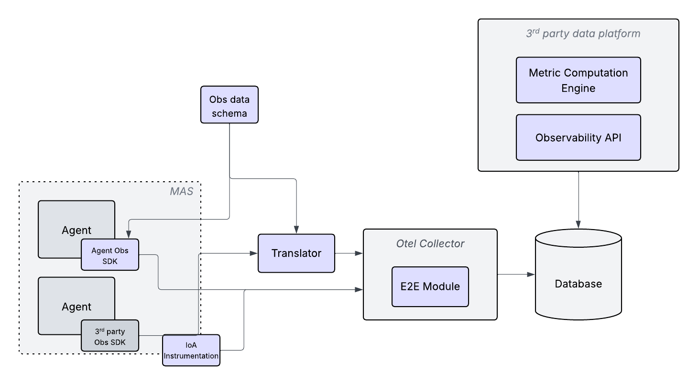

# Observability and Evaluation

## Introduction

In the Internet of Agents (IoA) vision, multiple agents collaborate — making sequential and sometimes parallel decisions — forming a multi-agent system (MAS). As the number and complexity of involved agents increase, it becomes increasingly challenging to understand how the system arrived at a particular state. Unlike traditional software, a MAS is mode up of many independant agents, interacting in unpredictable way, making it hard to see how the information is shared, how decisions are made and how the system works as a whole. This is where *observability* comes in: it provides visibility into the execution of a MAS by recording each action taken, along with its outcome, by the agents. This yields a complete view of a run: what each agent did, which agents interacted, which tools were used, etc. Observability must extend beyond traditional monitoring to inculde instrumentation of communication and reasoning layers, to give insights into message flows, interaction patterns and the decision-making behind agent collaboration.

While observability provides *factual information* about a MAS, *evaluation* judges its *quality and effectiveness*. Using the data produced by observability, evaluation surfaces performance through metrics that measure dimensions important to the user. For example, metrics can measure the relevance of the final output relative to the initial input, or the overall efficiency of the workflow (were there unnecessary loops during execution?). In effect, evaluation transforms raw telemetry into performance, reliability, cost-efficiency, and security signals. Evaluation can also be applied across multiple sessions (executions) over time to identify trends or performance decay.

## AGNTCY Observability and Evaluation Solution

At AGNTCY, we provide a set of components that, when combined, deliver an observability and evaluation solution for multi-agent systems. These components are shown in the diagram below:

In summary, we provide:
- An AGNTCY observability data schema that provides comprehensive coverage for MAS telemetry.
- An Observability SDK to instrument agents as well as agentic protocols (e.g., SLIM and A2A).
- A Metrics Computation Engine to derive higher-level metrics from raw telemetry.
- An Observability API to query traces and metrics produced by the SDK.
